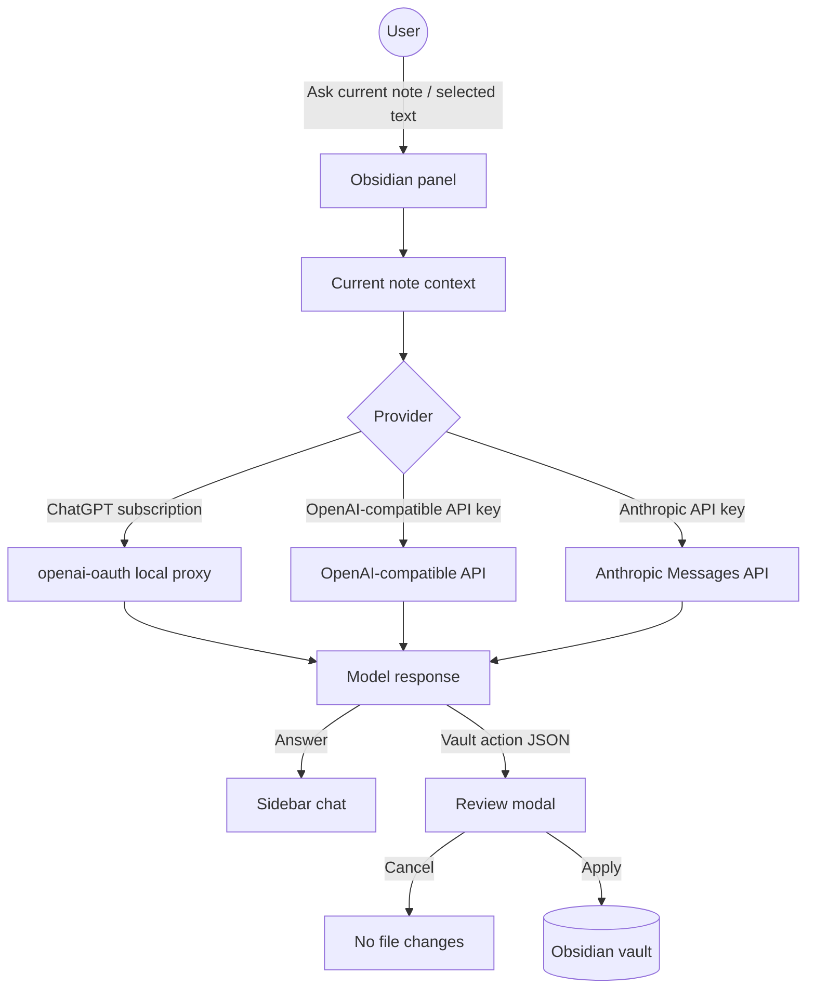

🌐 **Language / 언어 / 言語**: **English** | [한국어](README.ko.md) | [日本語](README.ja.md)

# Vault Action Bridge

AI note Q&A and reviewed vault file actions for Obsidian.


Vault Action Bridge adds an AI work panel to Obsidian. It can ask a configured model about the current note or selected text, and it can turn write requests into reviewed vault actions such as creating, appending, or modifying Markdown notes.

The plugin does **not** apply AI-suggested file changes automatically. Vault changes are applied only after you review and confirm them in Obsidian.

## Features

- Ask a model about the active Markdown note or selected text.
- Use a ChatGPT subscription through a local `openai-oauth` proxy.
- Use API-key providers: OpenAI, Anthropic Claude, OpenRouter, Groq, Gemini API, DeepSeek, Ollama/local, or a custom OpenAI-compatible endpoint.
- Review AI-proposed vault actions before they modify notes or folders.
- Open ChatGPT, Claude, and Gemini webviews from Obsidian.
- Optional Korean or English UI labels.

## Why These Features Exist

Vault Action Bridge is designed around one principle: AI can suggest changes, but the user keeps control of the vault.

- **Current note and selection Q&A** keeps the prompt small and understandable. Instead of sending an entire vault, the plugin sends only the note or text you choose for that request.
- **Provider presets** reduce setup mistakes. Most users should not need to remember provider URLs or whether Claude uses a different API shape.
- **Reviewed vault actions** make AI writes inspectable. The model returns structured JSON, the plugin summarizes the proposed changes, and only then can the user apply them.
- **Visible setup terminals** make local tool installation explicit. When setup needs Node.js, Codex, or `openai-oauth`, the user sees the commands in a normal terminal.

## How It Works



## Install Manually

Before the plugin is available in the Obsidian community directory, install it from a GitHub release:

```text
VaultFolder/.obsidian/plugins/vault-action-bridge/
```

Place these release assets in that folder:

```text
main.js
manifest.json
styles.css
```

Restart Obsidian, then enable `Vault Action Bridge` from Settings -> Community plugins.

## Provider Setup

Open Settings -> Community plugins -> Vault Action Bridge and choose a connection mode.

### ChatGPT Subscription Account

This mode uses `openai-oauth`, a local OpenAI-compatible proxy.

```text
Base URL: http://127.0.0.1:10531/v1
Model: gpt-5.4
API key: empty
```

The plugin does not manage your ChatGPT login session directly. It calls the local proxy URL after you run `openai-oauth`.

The settings page includes three visible terminal buttons:

1. `Install Node.js`
   - Windows: runs `winget install -e --id OpenJS.NodeJS.LTS`.
   - macOS: uses Homebrew if available, otherwise prints a Node.js download link.
   - Linux: checks for `node` and `npm`, then prints package-manager guidance.
2. `Install/update openai-oauth tools`
   - Checks for `codex` and `openai-oauth`.
   - Installs missing tools with:

```bash
npm install -g @openai/codex
npm install -g openai-oauth
```

3. `Login and run openai-oauth`
   - Runs:

```bash
npx @openai/codex login
npx openai-oauth
```

All install and login commands run in a visible terminal after you press a button. The plugin does not silently install tools or authenticate in the background.

### API Key Providers

Choose `API key provider` for:

- OpenAI
- Anthropic Claude
- OpenRouter
- Groq
- Gemini API
- DeepSeek
- Ollama / local
- Custom OpenAI-compatible endpoint

OpenAI-compatible providers use `/chat/completions`. Anthropic Claude uses the Anthropic Messages API (`/v1/messages`) with `x-api-key` and `anthropic-version` headers.

After entering an API key, use `Test connection` to refresh the available model list.

## Vault Actions

The model can propose these actions:

| Action | Description |
| --- | --- |
| `create_folder` | Create a folder in the vault |
| `create_note` | Create a Markdown note |
| `append_note` | Append content to an existing note |
| `modify_note` | Replace an existing note |

`modify_note` replaces the full file and is shown as a higher-risk action in the review modal.

Example:

```json
{
  "actions": [
    {
      "action": "create_folder",
      "path": "Research"
    },
    {
      "action": "create_note",
      "path": "Research/index.md",
      "content": "# Research\n\nNotes go here."
    }
  ]
}
```

All paths must be vault-relative. Absolute paths and `..` path traversal are rejected.

## Technical Design

The plugin is intentionally small and dependency-light. It uses plain JavaScript and CommonJS so the release artifact can be inspected directly as `main.js`.

### Obsidian APIs

- `Plugin`, `PluginSettingTab`, `ItemView`, `Modal`, and `Setting` build the UI.
- `requestUrl` sends model API requests through Obsidian's network helper.
- `Vault.create`, `Vault.createFolder`, and `Vault.process` apply reviewed file changes.
- `Plugin.loadData()` and `Plugin.saveData()` store settings such as provider choice, model, API key, and privacy options.

### Model API Layer

The model client has two request shapes:

- **OpenAI-compatible** providers use `POST /chat/completions` and parse `choices[0].message.content`.
- **Anthropic Claude** uses `POST /v1/messages`, `x-api-key`, and `anthropic-version`, then parses `content[].text`.

`openai-oauth` is treated as a local OpenAI-compatible provider. This lets ChatGPT subscription users run a local proxy without pasting an OpenAI API key into the plugin.

### Vault Action Layer

The model is asked to produce JSON only when it wants to modify the vault. The plugin accepts either a single action or an `actions` array, validates each vault-relative path, and rejects absolute paths or `..` traversal.

When applying actions:

- New notes use `Vault.create`.
- Folder creation uses `Vault.createFolder`.
- Existing note replacement and append operations use `Vault.process` so the update is handled by Obsidian's vault API.

## Testing Strategy

The test suite uses Node.js's built-in `node:test` runner and `node:assert`.

The tests cover:

- prompt building and chat history formatting,
- OpenAI-compatible and Anthropic request construction,
- provider model-list checks,
- response parsing,
- Obsidian view helper behavior,
- vault action parsing, validation, summarization, and execution,
- README disclosure checks for network use and setup commands.

Run all tests:

```bash
node --test tests/*.test.js
```

Run the full local verification before publishing:

```bash
npm run verify
```

## Privacy And Security Disclosures

Vault Action Bridge can send note content to external services, depending on your settings.

- When you ask about the current note or selected text, that content is sent to your configured model provider.
- If you use `openai-oauth`, prompts are sent to the local proxy URL you configure, usually `http://127.0.0.1:10531/v1`.
- If you use an API-key provider, prompts are sent to that provider's API endpoint.
- API keys and plugin settings are stored with Obsidian plugin data via `loadData()` and `saveData()`.
- The plugin includes visible terminal buttons that can run Node.js, npm, Codex, and `openai-oauth` setup commands after you press them.
- The plugin does not include client-side telemetry or analytics.
- The plugin can modify files in your Obsidian vault only after you approve reviewed vault actions.

For vulnerability reporting and the full security model, see [SECURITY.md](SECURITY.md).

## Commands

- Open Vault Action Bridge
- Toggle Vault Action Bridge
- Open ChatGPT webview
- Open Claude webview
- Open Gemini webview
- Ask model about current note
- Ask model about selected text
- Apply vault action JSON from clipboard

## Development

```bash
node --test tests/*.test.js
```

On Windows, if `node --test tests/*.test.js` fails with `Access is denied`, check whether `node` points to an app-packaged runtime instead of a normal Node.js install:

```powershell
Get-Command node -All
```

For development and release testing, install Node.js from https://nodejs.org/ and run tests in a new terminal.

GitHub Actions also runs the test suite on pushes to `main` and on pull requests.

## Additional Documentation

- [Architecture guide](docs/ARCHITECTURE.md)
- [Contributing guide](CONTRIBUTING.md)
- [Security policy](SECURITY.md)
- [Release guide](docs/RELEASE.md)

## Release Checklist

Before creating a GitHub release:

1. Update `manifest.json` version.
2. Update `package.json` version.
3. Update `versions.json` if the minimum Obsidian version changes.
4. Run tests.
5. Create a GitHub release whose tag exactly matches `manifest.json` version.
6. Upload release assets:

```text
main.js
manifest.json
styles.css
```

The plugin ID is:

```text
vault-action-bridge
```

## AI Development Disclosure

This project was built with human review and AI coding-agent assistance across design, implementation, tests, and documentation.

## License

MIT
