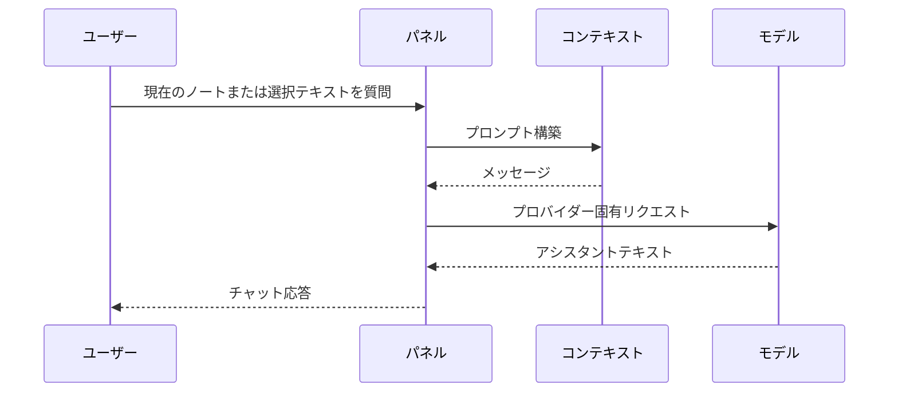
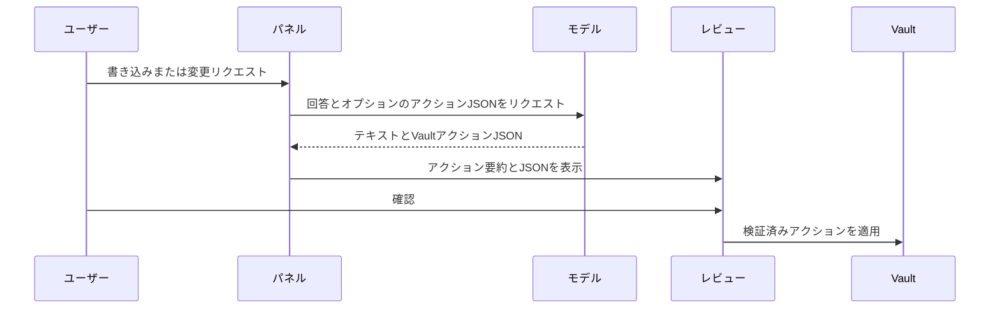

🌐 **Language / 언어 / 言語**: [English](ARCHITECTURE.md) | [한국어](ARCHITECTURE.ko.md) | **日本語**

# アーキテクチャ

このドキュメントはVault Action Bridgeの構成と各部分が存在する理由を説明します。

対象読者はJavaScriptを知っているが、Obsidianプラグインやプロバイダー APIに不慣れな初級〜中級の開発者です。

## 設計目標

Vault Action Bridgeには4つの主要目標があります：

1. **ユーザーに制御を維持させる。** AIはノートの変更を提案できますが、ユーザーがレビューして適用する必要があります。
2. **複数のモデルプロバイダーをサポートする。** ChatGPTサブスクリプションユーザー、APIキーユーザー、ローカルモデルユーザーすべてにパスがあるべきです。
3. **リスクのある動作を明示的にする。** ネットワーク呼び出し、ツールインストール、ファイル書き込みが可視化され文書化されるべきです。
4. **検査しやすく保つ。** プロジェクトは純粋なJavaScriptを使用し、ランタイム依存関係がありません。

## ランタイム構造

プラグインには2つのレイヤーがあります：

```text
main.js
  Obsidianプラグインランタイム。Obsidianがこのファイルを直接ロードします。

lib/
  main.jsで使用される同じコアロジックを持つテスト可能なモジュール。
```

`main.js`には実際のプラグインクラス、UI、コマンド、設定タブ、コアヘルパーのバンドルコピーが含まれています。`lib/`ファイルは、Obsidianを起動せずにNode.jsで重要な動作をテストできるように存在します。

この重複はトレードオフです。現在のリリースをシンプルに保ちながら、ユニットテストを可能にします。将来のTypeScript/ビルドステップでモジュールから`main.js`を生成し、重複を排除できます。

## 主要コンポーネント

### 設定と定数

ファイル：

- `main.js`
- `lib/constants.js`

定義する項目：

- Webアプリターゲット：ChatGPT、Claude、Gemini
- APIプロバイダープリセット
- デフォルト設定
- ObsidianビューID

プロバイダープリセットには`type`フィールドが含まれています。すべてのプロバイダーが同じAPIを使用するわけではないためです：

- `openai-compatible`は`/chat/completions`を使用します。
- `anthropic`は`/v1/messages`を使用します。

### モデルAPIレイヤー

ファイル：

- `main.js`
- `lib/llm-client.js`
- `tests/llm-client.test.js`

モデルクライアントはチャットメッセージをHTTPリクエストに変換します。

OpenAI互換リクエスト：

```text
POST /chat/completions
Authorization: Bearer <api-key>
```

Anthropicリクエスト：

```text
POST /v1/messages
x-api-key: <api-key>
anthropic-version: 2023-06-01
```

存在理由：プロバイダーAPIはユーザーの観点からは似ていますが、HTTPの詳細は異なります。差異を1つのクライアントに保つことで、プロバイダー固有の詳細がUI全体に漏れるのを防ぎます。

### コンテキストビルダー

ファイル：

- `lib/context-builder.js`
- `tests/context-builder.test.js`
- `main.js`内のマッチングロジック

コンテキストビルダーは以下からプロンプトを作成します：

- 現在のノートパス
- 現在のノートコンテンツ
- 選択テキスト
- 最近のチャット履歴
- ユーザーのテンプレート

存在理由：関連コンテキストのみを送信する方が、Vault全体を送信するよりも安全でコストが低いです。また、デバッグ中にプロンプトを推論しやすくなります。

### Vaultアクションレイヤー

ファイル：

- `main.js`
- `lib/vault-actions.js`
- `tests/vault-actions.test.js`

Vaultアクションはモデルからの構造化されたJSON提案です。

サポートされるアクション：

- `create_folder`
- `create_note`
- `append_note`
- `modify_note`

アクションを適用する前に、プラグインは：

1. JSONをパースします。
2. アクションの形式を検証します。
3. Vault相対パスを検証します。
4. レビューモーダルを表示します。
5. 確認後にのみ適用します。

存在理由：モデルテキストはそれ自体で安全な命令形式ではありません。JSONは提案されたファイル変更を可視的、編集可能、テスト可能にします。

### レビューモーダル

ファイル：

- `main.js`

レビューモーダルは以下を表示します：

- アクションラベル
- ターゲットパス
- リスクレベル
- 編集可能なJSON
- 確認/キャンセルコントロール

存在理由：ファイル書き込みには人間のチェックポイントが必要です。優れたモデルでもユーザーの意図を誤解することがあります。

### ウェブビュー

ファイル：

- `main.js`
- `lib/webview-bridge.js`
- `tests/webview-bridge.test.js`

プラグインはChatGPT、Claude、Geminiウェブビューを開くことができます。ChatGPT Webインジェクションコードは、Web UIが変更される可能性があるため分離されています。

存在理由：一部のユーザーは会話型作業にプロバイダーのWeb UIを好みながら、Vault対応プロンプトにはObsidianパネルを使用する場合があります。

## データフロー

### 質問する



### Vaultアクションの適用



## テストレイヤー

テストはObsidian外部で証明できる動作に焦点を当てます：

- リクエスト構築
- レスポンスパース
- 設定デフォルト
- Vaultアクション検証
- フェイクVault実行動作
- READMEおよびリリースメタデータチェック

これは手動のObsidianテストの代替にはなりません。リリース前に、ローカルVaultにプラグインをインストールして以下を確認してください：

- プラグインがロードされる
- 設定タブがレンダリングされる
- プロバイダー接続チェックが動作する
- ファイル変更前にレビューモーダルが表示される

## 既知のトレードオフ

### TypeScriptの代わりに純粋なJavaScript

プロジェクトは現在、型ツールよりもシンプルなリリース検査を優先しています。TypeScriptはエディターサポートを改善し重複を減らしますが、ビルドステップを追加します。

### `main.js`のバンドルされたロジック

Obsidianは`main.js`を直接ロードします。コアロジックはテスト用に`lib/`にもミラーリングされています。現在のサイズでは許容可能ですが、将来のビルドパイプラインはソースモジュールから`main.js`を生成すべきです。

### 表示されるターミナルセットアップボタン

セットアップボタンは便利ですが機密性があります。意図的に可視的でユーザーがトリガーし、README/SECURITYドキュメントで開示されています。決してサイレントバックグラウンドインストーラーになってはいけません。
