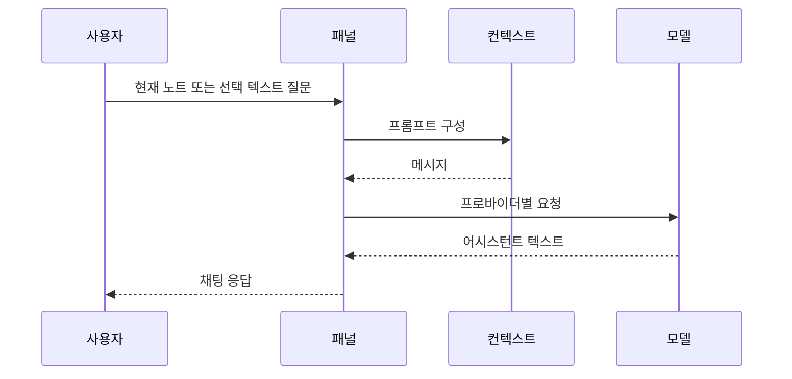
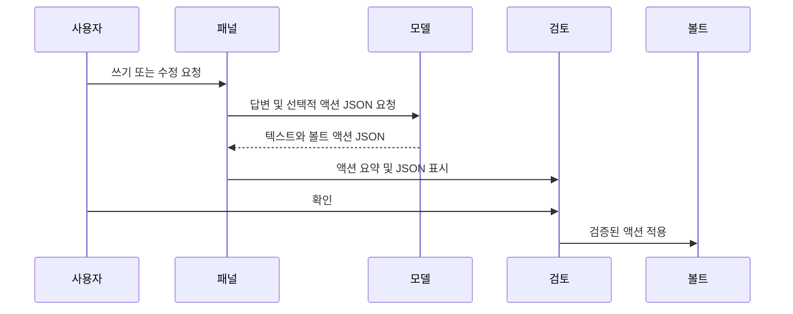

🌐 **Language / 언어 / 言語**: [English](ARCHITECTURE.md) | **한국어** | [日本語](ARCHITECTURE.ja.md)

# 아키텍처

이 문서는 Vault Action Bridge의 구성과 각 부분이 존재하는 이유를 설명합니다.

대상 독자는 JavaScript를 알지만 Obsidian 플러그인이나 AI 프로바이더 API에 익숙하지 않을 수 있는 초급~중급 개발자입니다.

## 설계 목표

Vault Action Bridge에는 네 가지 주요 목표가 있습니다:

1. **사용자에게 통제권을 유지합니다.** AI는 노트 변경을 제안할 수 있지만, 사용자가 검토하고 적용해야 합니다.
2. **여러 모델 프로바이더를 지원합니다.** ChatGPT 구독 사용자, API 키 사용자, 로컬 모델 사용자 모두 경로가 있어야 합니다.
3. **위험한 동작을 명시적으로 만듭니다.** 네트워크 호출, 도구 설치, 파일 쓰기가 눈에 보이고 문서화되어야 합니다.
4. **검사하기 쉽게 유지합니다.** 프로젝트는 순수 JavaScript를 사용하고 런타임 의존성이 없습니다.

## 런타임 구조

플러그인에는 두 개의 레이어가 있습니다:

```text
main.js
  Obsidian 플러그인 런타임. Obsidian이 이 파일을 직접 로드합니다.

lib/
  main.js에서 사용하는 동일한 핵심 로직을 가진 테스트 가능한 모듈.
```

`main.js`에는 실제 플러그인 클래스, UI, 명령어, 설정 탭, 핵심 헬퍼의 번들 복사본이 포함되어 있습니다. `lib/` 파일은 Obsidian을 실행하지 않고 Node.js로 중요한 동작을 테스트할 수 있도록 존재합니다.

이 중복은 트레이드오프입니다. 오늘날 릴리스를 단순하게 유지하면서 단위 테스트를 허용합니다. 향후 TypeScript/빌드 단계에서 모듈로부터 `main.js`를 생성하여 중복을 제거할 수 있습니다.

## 주요 컴포넌트

### 설정 및 상수

파일:

- `main.js`
- `lib/constants.js`

정의하는 항목:

- 웹 앱 대상: ChatGPT, Claude, Gemini
- API 프로바이더 프리셋
- 기본 설정
- Obsidian 뷰 ID

프로바이더 프리셋에는 `type` 필드가 포함되어 있습니다. 모든 프로바이더가 동일한 API를 사용하지 않기 때문입니다:

- `openai-compatible`는 `/chat/completions`를 사용합니다.
- `anthropic`는 `/v1/messages`를 사용합니다.

### 모델 API 레이어

파일:

- `main.js`
- `lib/llm-client.js`
- `tests/llm-client.test.js`

모델 클라이언트는 채팅 메시지를 HTTP 요청으로 변환합니다.

OpenAI 호환 요청:

```text
POST /chat/completions
Authorization: Bearer <api-key>
```

Anthropic 요청:

```text
POST /v1/messages
x-api-key: <api-key>
anthropic-version: 2023-06-01
```

존재 이유: 프로바이더 API는 사용자 관점에서 비슷해 보이지만 HTTP 세부 사항이 다릅니다. 차이를 하나의 클라이언트에 유지하면 프로바이더별 세부 사항이 UI 전체로 누출되는 것을 방지합니다.

### 컨텍스트 빌더

파일:

- `lib/context-builder.js`
- `tests/context-builder.test.js`
- `main.js` 내부의 매칭 로직

컨텍스트 빌더는 다음으로부터 프롬프트를 생성합니다:

- 현재 노트 경로
- 현재 노트 내용
- 선택한 텍스트
- 최근 채팅 히스토리
- 사용자의 템플릿

존재 이유: 관련 컨텍스트만 전송하는 것이 전체 볼트를 전송하는 것보다 더 안전하고 비용이 적습니다. 또한 디버깅 중 프롬프트를 더 쉽게 추론할 수 있습니다.

### 볼트 액션 레이어

파일:

- `main.js`
- `lib/vault-actions.js`
- `tests/vault-actions.test.js`

볼트 액션은 모델의 구조화된 JSON 제안입니다.

지원되는 액션:

- `create_folder`
- `create_note`
- `append_note`
- `modify_note`

액션을 적용하기 전에 플러그인은:

1. JSON을 파싱합니다.
2. 액션 형식을 검증합니다.
3. 볼트 상대 경로를 검증합니다.
4. 검토 모달을 표시합니다.
5. 확인 후에만 적용합니다.

존재 이유: 모델 텍스트는 그 자체로 안전한 명령 형식이 아닙니다. JSON은 제안된 파일 변경을 가시적이고, 편집 가능하며, 테스트 가능하게 만듭니다.

### 검토 모달

파일:

- `main.js`

검토 모달은 다음을 표시합니다:

- 액션 라벨
- 대상 경로
- 위험 수준
- 편집 가능한 JSON
- 확인/취소 컨트롤

존재 이유: 파일 쓰기에는 사람의 확인 지점이 필요합니다. 좋은 모델이라도 사용자의 의도를 잘못 이해할 수 있습니다.

### 웹뷰

파일:

- `main.js`
- `lib/webview-bridge.js`
- `tests/webview-bridge.test.js`

플러그인은 ChatGPT, Claude, Gemini 웹뷰를 열 수 있습니다. ChatGPT 웹 인젝션 코드는 웹 UI가 변경될 수 있으므로 분리되어 있습니다.

존재 이유: 일부 사용자는 대화형 작업에 프로바이더의 웹 UI를 선호하면서도, 볼트 인식 프롬프트에는 Obsidian 패널을 사용할 수 있습니다.

## 데이터 흐름

### 질문하기



### 볼트 액션 적용



## 테스트 레이어

테스트는 Obsidian 외부에서 증명할 수 있는 동작에 집중합니다:

- 요청 구성
- 응답 파싱
- 설정 기본값
- 볼트 액션 검증
- 가짜 볼트 실행 동작
- README 및 릴리스 메타데이터 검사

이것은 수동 Obsidian 테스트를 대체하지 않습니다. 릴리스 전에 여전히 로컬 볼트에 플러그인을 설치하고 다음을 확인해야 합니다:

- 플러그인 로드
- 설정 탭 렌더링
- 프로바이더 연결 확인 작동
- 파일 변경 전 검토 모달 표시

## 알려진 트레이드오프

### TypeScript 대신 순수 JavaScript

프로젝트는 현재 타입 도구보다 단순한 릴리스 검사를 선호합니다. TypeScript는 에디터 지원을 개선하고 중복을 줄이지만, 빌드 단계를 추가합니다.

### `main.js`의 번들된 로직

Obsidian은 `main.js`를 직접 로드합니다. 핵심 로직은 테스트를 위해 `lib/`에도 미러링되어 있습니다. 현재 크기에서는 허용 가능하지만, 향후 빌드 파이프라인은 소스 모듈에서 `main.js`를 생성해야 합니다.

### 표시되는 터미널 설정 버튼

설정 버튼은 편리하지만 민감합니다. 의도적으로 눈에 보이고 사용자가 트리거하며, README/SECURITY 문서에서 공개됩니다. 절대로 자동 백그라운드 설치기가 되어서는 안 됩니다.
