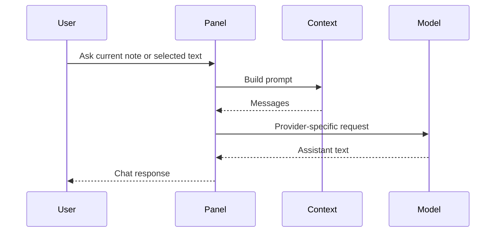
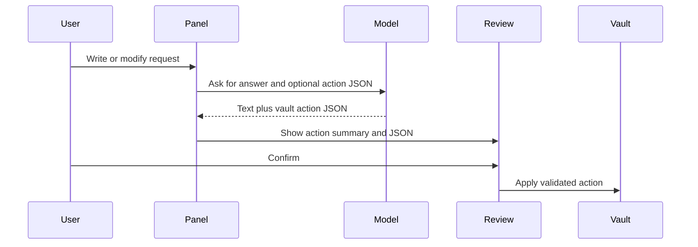

🌐 **Language / 언어 / 言語**: **English** | [한국어](ARCHITECTURE.ko.md) | [日本語](ARCHITECTURE.ja.md)

# Architecture

This document explains how Vault Pilot is organized and why each part exists.

The target reader is a beginner-to-intermediate developer who knows JavaScript but may be new to Obsidian plugins or AI provider APIs.

## Design Goals

Vault Pilot has four main goals:

1. **Keep the user in control.** AI can propose note changes, but the user must review and apply them.
2. **Support multiple model providers.** ChatGPT subscription users, API-key users, and local-model users should all have a path.
3. **Make risky behavior explicit.** Network calls, tool installation, and file writes should be visible and documented.
4. **Stay easy to inspect.** The project uses plain JavaScript and no runtime dependencies.

## Runtime Shape

The plugin has two layers:

```text
main.js
  The Obsidian plugin runtime. Obsidian loads this file directly.

lib/
  Testable modules with the same core logic used by main.js.
```

`main.js` contains the actual plugin classes, UI, commands, settings tab, and bundled copies of core helpers. The `lib/` files exist so the important behavior can be tested with Node.js without launching Obsidian.

This duplication is a tradeoff. It keeps releases simple today, while still allowing unit tests. A future TypeScript/build step could generate `main.js` from modules and remove duplication.

## Main Components

### Settings and constants

Files:

- `main.js`
- `lib/constants.js`

These define:

- web app targets: ChatGPT, Claude, Gemini,
- API provider presets,
- default settings,
- Obsidian view IDs.

Provider presets include a `type` field because not every provider speaks the same API:

- `openai-compatible` uses `/chat/completions`,
- `anthropic` uses `/v1/messages`.

### Model API Layer

Files:

- `main.js`
- `lib/llm-client.js`
- `tests/llm-client.test.js`

The model client turns chat messages into HTTP requests.

OpenAI-compatible request:

```text
POST /chat/completions
Authorization: Bearer <api-key>
```

Anthropic request:

```text
POST /v1/messages
x-api-key: <api-key>
anthropic-version: 2023-06-01
```

Why this exists: provider APIs look similar from the user's point of view, but the HTTP details differ. Keeping the difference in one client prevents provider-specific details from leaking across the UI.

### Context builder

Files:

- `lib/context-builder.js`
- `tests/context-builder.test.js`
- matching logic inside `main.js`

The context builder creates the prompt from:

- current note path,
- current note content,
- selected text,
- recent chat history,
- the user's template.

Why this exists: sending only relevant context is safer and cheaper than sending the whole vault. It also makes prompts easier to reason about during debugging.

### Vault Action Layer

Files:

- `main.js`
- `lib/vault-actions.js`
- `tests/vault-actions.test.js`

Vault actions are structured JSON proposals from the model.

Supported actions:

- `create_folder`
- `create_note`
- `append_note`
- `modify_note`

Before applying an action, the plugin:

1. parses JSON,
2. validates action shape,
3. validates vault-relative paths,
4. shows a review modal,
5. applies only after confirmation.

Why this exists: model text is not a safe instruction format by itself. JSON makes proposed file changes visible, editable, and testable.

### Review modal

File:

- `main.js`

The review modal shows:

- action labels,
- target paths,
- risk level,
- editable JSON,
- confirm/cancel controls.

Why this exists: file writes need a human checkpoint. Even a good model can misunderstand the user's intent.

### Webviews

Files:

- `main.js`
- `lib/webview-bridge.js`
- `tests/webview-bridge.test.js`

The plugin can open ChatGPT, Claude, and Gemini webviews. The ChatGPT web injection code is isolated because web UIs can change.

Why this exists: some users may prefer a provider's web UI for conversational work, while still using the Obsidian panel for vault-aware prompts.

## Data Flow

### Asking a question



### Applying a vault action



## Testing Layers

The tests focus on behavior that can be proven outside Obsidian:

- request construction,
- response parsing,
- settings defaults,
- vault action validation,
- fake-vault execution behavior,
- README and release metadata checks.

This does not replace manual Obsidian testing. Before release, still install the plugin into a local vault and check:

- plugin loads,
- settings tab renders,
- provider connection check works,
- review modal appears before file changes.

## Known Tradeoffs

### Plain JavaScript instead of TypeScript

The project currently favors simple release inspection over type tooling. TypeScript would improve editor support and reduce duplication, but it would add a build step.

### Bundled logic in `main.js`

Obsidian loads `main.js` directly. Core logic is also mirrored in `lib/` for tests. This is acceptable for the current size, but a future build pipeline should generate `main.js` from source modules.

### Visible terminal setup buttons

The setup buttons are convenient but sensitive. They are intentionally visible and user-triggered, and the README/SECURITY docs disclose them. They should never become silent background installers.
