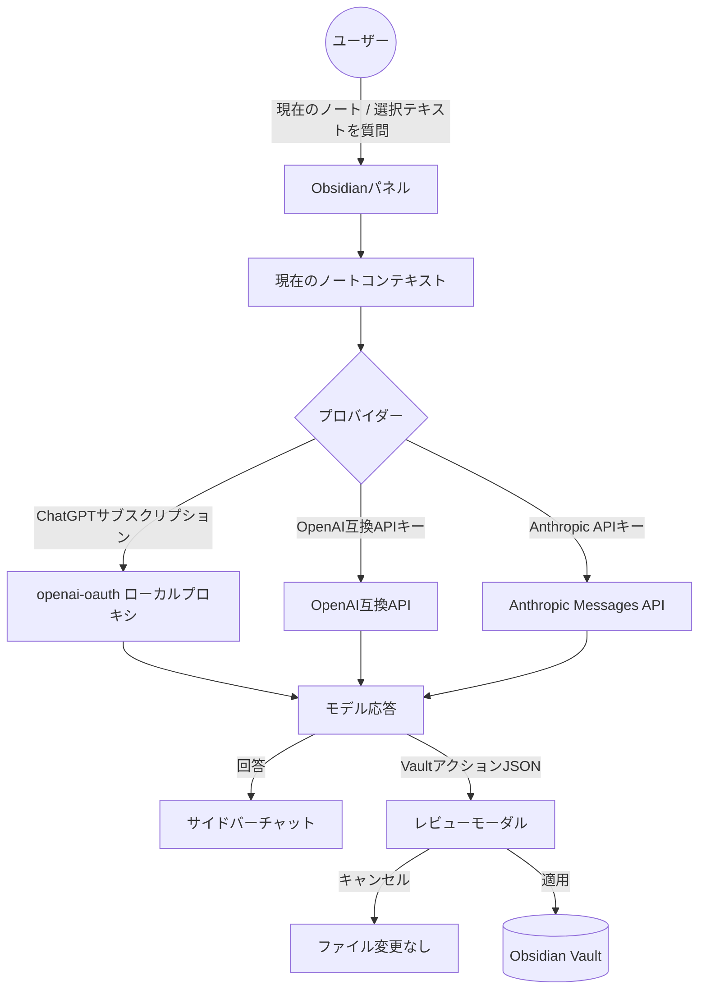

🌐 **Language / 언어 / 言語**: [English](../README.md) | [한국어](../ko/README.ko.md) | **日本語**

# Vault Action Bridge

Obsidian用 AIノートQ&Aおよびレビュー付きVaultファイルアクションプラグイン。


Vault Action BridgeはObsidianにAI作業パネルを追加します。現在のノートや選択テキストについてモデルに質問でき、書き込みリクエストをMarkdownノートの作成・追加・変更などのレビュー可能なVaultアクションに変換します。

このプラグインはAIが提案したファイル変更を**自動的に適用しません**。Vaultの変更はObsidianでユーザーがレビューし承認した後にのみ適用されます。

## 機能

- 現在のMarkdownノートまたは選択テキストについてモデルに質問
- ローカル`openai-oauth`プロキシを通じたChatGPTサブスクリプションの使用
- APIキープロバイダー対応：OpenAI、Anthropic Claude、OpenRouter、Groq、Gemini API、DeepSeek、Ollama/ローカル、またはカスタムOpenAI互換エンドポイント
- AIが提案したVaultアクションを適用前にレビュー
- Obsidian内でChatGPT、Claude、Geminiウェブビューを開く
- 韓国語/英語UIラベルの選択が可能

## これらの機能が存在する理由

Vault Action Bridgeは一つの原則を中心に設計されています：AIは変更を提案できますが、Vaultの制御権はユーザーにあります。

- **現在のノートと選択範囲のQ&A**はプロンプトを小さく理解しやすく保ちます。Vault全体を送信する代わりに、そのリクエストで選択したノートやテキストのみを送信します。
- **プロバイダープリセット**は設定ミスを減らします。ほとんどのユーザーはプロバイダーURLやClaudeが異なるAPI形式を使用するかどうかを覚える必要がありません。
- **レビュー付きVaultアクション**はAIの書き込み操作を透明にします。モデルが構造化JSONを返すと、プラグインが提案された変更を要約し、その後ユーザーが適用できます。
- **表示されるセットアップターミナル**はローカルツールのインストールを明示的に示します。Node.js、Codex、または`openai-oauth`のセットアップが必要な場合、ユーザーは通常のターミナルでコマンドを確認できます。

## 動作の仕組み



## 手動インストール

プラグインがObsidianコミュニティディレクトリに登録される前は、GitHubリリースからインストールします：

```text
VaultFolder/.obsidian/plugins/vault-action-bridge/
```

そのフォルダに以下のリリースファイルを配置します：

```text
main.js
manifest.json
styles.css
```

Obsidianを再起動し、設定 → コミュニティプラグインから`Vault Action Bridge`を有効にします。

## プロバイダー設定

設定 → コミュニティプラグイン → Vault Action Bridgeで接続モードを選択します。

### ChatGPTサブスクリプションアカウント

このモードはローカルOpenAI互換プロキシの`openai-oauth`を使用します。

```text
Base URL: http://127.0.0.1:10531/v1
Model: gpt-5.4
API key: 空欄
```

プラグインはChatGPTログインセッションを直接管理しません。`openai-oauth`を実行した後、ローカルプロキシURLを呼び出します。

設定ページには3つの表示されるターミナルボタンがあります：

1. `Install Node.js`
   - Windows：`winget install -e --id OpenJS.NodeJS.LTS`を実行します。
   - macOS：Homebrewがあれば使用し、なければNode.jsダウンロードリンクを表示します。
   - Linux：`node`と`npm`を確認した後、パッケージマネージャーのガイダンスを表示します。
2. `Install/update openai-oauth tools`
   - `codex`と`openai-oauth`を確認します。
   - 不足しているツールを以下のコマンドでインストールします：

```bash
npm install -g @openai/codex
npm install -g openai-oauth
```

3. `Login and run openai-oauth`
   - 以下のコマンドを実行します：

```bash
npx @openai/codex login
npx openai-oauth
```

すべてのインストールとログインコマンドは、ボタンを押した後に表示されるターミナルで実行されます。プラグインはツールを自動的にインストールしたり、バックグラウンドで認証を行いません。

### APIキープロバイダー

以下のプロバイダーに対して`API key provider`を選択します：

- OpenAI
- Anthropic Claude
- OpenRouter
- Groq
- Gemini API
- DeepSeek
- Ollama / ローカル
- カスタムOpenAI互換エンドポイント

OpenAI互換プロバイダーは`/chat/completions`を使用します。Anthropic Claudeは`x-api-key`および`anthropic-version`ヘッダーとともにAnthropic Messages API（`/v1/messages`）を使用します。

APIキーを入力した後、`Test connection`を使用して利用可能なモデルリストを更新します。

## Vaultアクション

モデルが提案できるアクションは以下の通りです：

| アクション | 説明 |
| --- | --- |
| `create_folder` | Vaultにフォルダを作成 |
| `create_note` | Markdownノートを作成 |
| `append_note` | 既存のノートにコンテンツを追加 |
| `modify_note` | 既存のノートを置換 |

`modify_note`はファイル全体を置換し、レビューモーダルで高リスクアクションとして表示されます。

例：

```json
{
  "actions": [
    {
      "action": "create_folder",
      "path": "Research"
    },
    {
      "action": "create_note",
      "path": "Research/index.md",
      "content": "# Research\n\nここにノートを書きます。"
    }
  ]
}
```

すべてのパスはVault相対パスでなければなりません。絶対パスと`..`パストラバーサルは拒否されます。

## 技術設計

このプラグインは意図的に小さく、依存関係が少なく設計されています。純粋なJavaScriptとCommonJSを使用しており、リリースアーティファクトを`main.js`として直接検査できます。

### Obsidian API

- `Plugin`、`PluginSettingTab`、`ItemView`、`Modal`、`Setting`でUIを構成します。
- `requestUrl`でObsidianのネットワークヘルパーを通じてモデルAPIリクエストを送信します。
- `Vault.create`、`Vault.createFolder`、`Vault.process`でレビュー済みのファイル変更を適用します。
- `Plugin.loadData()`と`Plugin.saveData()`でプロバイダー選択、モデル、APIキー、プライバシーオプションなどの設定を保存します。

### モデルAPIレイヤー

モデルクライアントには2つのリクエスト形式があります：

- **OpenAI互換**プロバイダーは`POST /chat/completions`を使用し、`choices[0].message.content`をパースします。
- **Anthropic Claude**は`POST /v1/messages`、`x-api-key`、`anthropic-version`を使用し、`content[].text`をパースします。

`openai-oauth`はローカルOpenAI互換プロバイダーとして扱われます。これにより、ChatGPTサブスクリプションユーザーがOpenAI APIキーをプラグインに入力せずにローカルプロキシを実行できます。

### VaultアクションレイヤーAI

モデルがVaultを変更しようとする場合のみJSON生成を要求します。プラグインは単一アクションまたは`actions`配列の両方を受け入れ、各Vault相対パスを検証し、絶対パスや`..`トラバーサルを拒否します。

アクション適用時：

- 新しいノートは`Vault.create`を使用します。
- フォルダ作成は`Vault.createFolder`を使用します。
- 既存ノートの置換と追加操作は`Vault.process`を使用し、ObsidianのVault APIが処理します。

## テスト戦略

テストスイートはNode.js内蔵の`node:test`ランナーと`node:assert`を使用します。

テスト範囲：

- プロンプト構築とチャット履歴フォーマット
- OpenAI互換およびAnthropicリクエスト構築
- プロバイダーモデルリスト確認
- レスポンスパース
- Obsidianビューヘルパーの動作
- Vaultアクションのパース、検証、要約、実行
- ネットワーク使用とセットアップコマンドのREADME開示確認

すべてのテストを実行：

```bash
node --test tests/*.test.js
```

公開前の完全なローカル検証を実行：

```bash
npm run verify
```

## プライバシーとセキュリティの開示

Vault Action Bridgeは設定に応じてノートコンテンツを外部サービスに送信することがあります。

- 現在のノートや選択テキストについて質問すると、そのコンテンツは設定されたモデルプロバイダーに送信されます。
- `openai-oauth`を使用する場合、プロンプトは設定したローカルプロキシURL（通常`http://127.0.0.1:10531/v1`）に送信されます。
- APIキープロバイダーを使用する場合、プロンプトはそのプロバイダーのAPIエンドポイントに送信されます。
- APIキーとプラグイン設定は`loadData()`および`saveData()`を通じてObsidianプラグインデータに保存されます。
- プラグインにはボタンを押した後にNode.js、npm、Codex、`openai-oauth`セットアップコマンドを実行できる表示されるターミナルボタンが含まれています。
- プラグインにはクライアント側のテレメトリやアナリティクス機能は含まれていません。
- プラグインはレビュー済みVaultアクションを承認した後にのみObsidian Vaultのファイルを変更できます。

脆弱性報告と完全なセキュリティモデルについては[SECURITY.md](SECURITY.ja.md)を参照してください。

## コマンド

- Vault Action Bridgeを開く
- Vault Action Bridgeの切り替え
- ChatGPTウェブビューを開く
- Claudeウェブビューを開く
- Geminiウェブビューを開く
- 現在のノートについてモデルに質問
- 選択テキストについてモデルに質問
- クリップボードからVaultアクションJSONを適用

## 開発

```bash
node --test tests/*.test.js
```

Windowsで`node --test tests/*.test.js`が`Access is denied`エラーで失敗する場合、`node`が通常のNode.jsインストールではなくアプリパッケージランタイムを指していないか確認します：

```powershell
Get-Command node -All
```

開発およびリリーステスト用に https://nodejs.org/ からNode.jsをインストールし、新しいターミナルでテストを実行します。

GitHub Actionsも`main`ブランチへのプッシュとプルリクエストでテストスイートを実行します。

## 追加ドキュメント

- [アーキテクチャガイド](../docs/ARCHITECTURE.ja.md)
- [コントリビューションガイド](CONTRIBUTING.ja.md)
- [セキュリティポリシー](SECURITY.ja.md)
- [リリースガイド](../docs/RELEASE.ja.md)

## リリースチェックリスト

GitHubリリース作成前：

1. `manifest.json`のバージョンを更新します。
2. `package.json`のバージョンを更新します。
3. 最小Obsidianバージョンが変更された場合、`versions.json`を更新します。
4. テストを実行します。
5. `manifest.json`のバージョンと正確に一致するタグでGitHubリリースを作成します。
6. リリースアセットをアップロードします：

```text
main.js
manifest.json
styles.css
```

プラグインID：

```text
vault-action-bridge
```

## AI開発の開示

このプロジェクトは設計、実装、テスト、ドキュメント全般にわたって、人間のレビューとAIコーディングエージェントの支援を受けて開発されました。

## ライセンス

MIT
