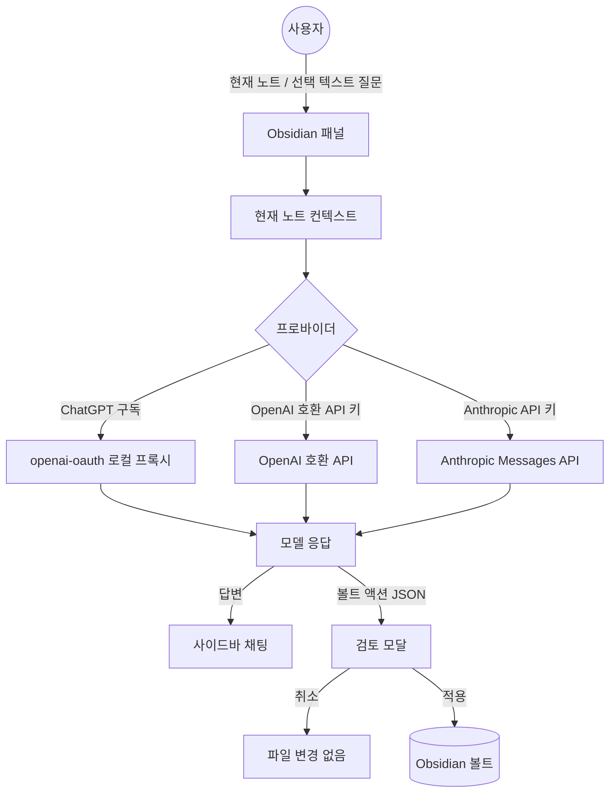

🌐 **Language / 언어 / 言語**: [English](../README.md) | **한국어** | [日本語](../ja/README.ja.md)

# Vault Action Bridge

Obsidian용 AI 노트 Q&A 및 검토 기반 볼트 파일 액션 플러그인.


Vault Action Bridge는 Obsidian에 AI 작업 패널을 추가합니다. 현재 노트나 선택한 텍스트에 대해 모델에 질문할 수 있으며, 작성 요청을 마크다운 노트의 생성·추가·수정 등 검토 가능한 볼트 액션으로 변환합니다.

이 플러그인은 AI가 제안한 파일 변경을 **자동으로 적용하지 않습니다**. 볼트 변경은 Obsidian에서 사용자가 직접 검토하고 승인한 후에만 적용됩니다.

## 기능

- 현재 마크다운 노트 또는 선택한 텍스트에 대해 모델에 질문
- 로컬 `openai-oauth` 프록시를 통한 ChatGPT 구독 사용
- API 키 프로바이더 지원: OpenAI, Anthropic Claude, OpenRouter, Groq, Gemini API, DeepSeek, Ollama/로컬, 또는 커스텀 OpenAI 호환 엔드포인트
- AI가 제안한 볼트 액션을 적용 전에 검토
- Obsidian 내에서 ChatGPT, Claude, Gemini 웹뷰 열기
- 한국어/영어 UI 라벨 선택 가능

## 이러한 기능이 존재하는 이유

Vault Action Bridge는 하나의 원칙을 중심으로 설계되었습니다: AI는 변경을 제안할 수 있지만, 볼트의 통제권은 사용자에게 있습니다.

- **현재 노트 및 선택 영역 Q&A**는 프롬프트를 작고 이해하기 쉽게 유지합니다. 전체 볼트를 보내는 대신, 해당 요청에 대해 선택한 노트나 텍스트만 전송합니다.
- **프로바이더 프리셋**은 설정 실수를 줄여줍니다. 대부분의 사용자는 프로바이더 URL이나 Claude가 다른 API 형식을 사용하는지 기억할 필요가 없습니다.
- **검토 기반 볼트 액션**은 AI의 쓰기 작업을 투명하게 만듭니다. 모델이 구조화된 JSON을 반환하면 플러그인이 제안된 변경 사항을 요약하고, 그 후에야 사용자가 적용할 수 있습니다.
- **표시되는 설정 터미널**은 로컬 도구 설치를 명시적으로 보여줍니다. Node.js, Codex, 또는 `openai-oauth` 설정이 필요할 때 사용자는 일반 터미널에서 명령어를 확인할 수 있습니다.

## 작동 방식



## 수동 설치

플러그인이 Obsidian 커뮤니티 디렉터리에 등록되기 전에는 GitHub 릴리스에서 설치합니다:

```text
VaultFolder/.obsidian/plugins/vault-action-bridge/
```

해당 폴더에 다음 릴리스 파일을 배치합니다:

```text
main.js
manifest.json
styles.css
```

Obsidian을 재시작한 후 설정 -> 커뮤니티 플러그인에서 `Vault Action Bridge`를 활성화합니다.

## 프로바이더 설정

설정 -> 커뮤니티 플러그인 -> Vault Action Bridge에서 연결 모드를 선택합니다.

### ChatGPT 구독 계정

이 모드는 로컬 OpenAI 호환 프록시인 `openai-oauth`를 사용합니다.

```text
Base URL: http://127.0.0.1:10531/v1
Model: gpt-5.4
API key: 비워둠
```

플러그인은 ChatGPT 로그인 세션을 직접 관리하지 않습니다. `openai-oauth`를 실행한 후 로컬 프록시 URL을 호출합니다.

설정 페이지에는 세 개의 표시되는 터미널 버튼이 있습니다:

1. `Install Node.js`
   - Windows: `winget install -e --id OpenJS.NodeJS.LTS`를 실행합니다.
   - macOS: Homebrew가 있으면 사용하고, 없으면 Node.js 다운로드 링크를 출력합니다.
   - Linux: `node`와 `npm`을 확인한 후 패키지 매니저 안내를 출력합니다.
2. `Install/update openai-oauth tools`
   - `codex`와 `openai-oauth`를 확인합니다.
   - 누락된 도구를 다음 명령으로 설치합니다:

```bash
npm install -g @openai/codex
npm install -g openai-oauth
```

3. `Login and run openai-oauth`
   - 다음 명령을 실행합니다:

```bash
npx @openai/codex login
npx openai-oauth
```

모든 설치 및 로그인 명령은 버튼을 누른 후 표시되는 터미널에서 실행됩니다. 플러그인은 도구를 자동으로 설치하거나 백그라운드에서 인증하지 않습니다.

### API 키 프로바이더

다음 프로바이더에 대해 `API key provider`를 선택합니다:

- OpenAI
- Anthropic Claude
- OpenRouter
- Groq
- Gemini API
- DeepSeek
- Ollama / 로컬
- 커스텀 OpenAI 호환 엔드포인트

OpenAI 호환 프로바이더는 `/chat/completions`를 사용합니다. Anthropic Claude는 `x-api-key` 및 `anthropic-version` 헤더와 함께 Anthropic Messages API(`/v1/messages`)를 사용합니다.

API 키를 입력한 후 `Test connection`을 사용하여 사용 가능한 모델 목록을 새로고침합니다.

## 볼트 액션

모델이 제안할 수 있는 액션은 다음과 같습니다:

| 액션 | 설명 |
| --- | --- |
| `create_folder` | 볼트에 폴더 생성 |
| `create_note` | 마크다운 노트 생성 |
| `append_note` | 기존 노트에 내용 추가 |
| `modify_note` | 기존 노트 교체 |

`modify_note`는 파일 전체를 교체하며 검토 모달에서 높은 위험 액션으로 표시됩니다.

예시:

```json
{
  "actions": [
    {
      "action": "create_folder",
      "path": "Research"
    },
    {
      "action": "create_note",
      "path": "Research/index.md",
      "content": "# Research\n\n여기에 노트를 작성합니다."
    }
  ]
}
```

모든 경로는 볼트 상대 경로여야 합니다. 절대 경로와 `..` 경로 탐색은 거부됩니다.

## 기술 설계

이 플러그인은 의도적으로 작고 의존성이 적게 설계되었습니다. 순수 JavaScript와 CommonJS를 사용하여 릴리스 아티팩트를 `main.js`로 직접 검사할 수 있습니다.

### Obsidian API

- `Plugin`, `PluginSettingTab`, `ItemView`, `Modal`, `Setting`으로 UI를 구성합니다.
- `requestUrl`로 Obsidian의 네트워크 헬퍼를 통해 모델 API 요청을 전송합니다.
- `Vault.create`, `Vault.createFolder`, `Vault.process`로 검토된 파일 변경을 적용합니다.
- `Plugin.loadData()`와 `Plugin.saveData()`로 프로바이더 선택, 모델, API 키, 프라이버시 옵션 등의 설정을 저장합니다.

### 모델 API 레이어

모델 클라이언트에는 두 가지 요청 형식이 있습니다:

- **OpenAI 호환** 프로바이더는 `POST /chat/completions`를 사용하고 `choices[0].message.content`를 파싱합니다.
- **Anthropic Claude**는 `POST /v1/messages`, `x-api-key`, `anthropic-version`을 사용하고 `content[].text`를 파싱합니다.

`openai-oauth`는 로컬 OpenAI 호환 프로바이더로 취급됩니다. 이를 통해 ChatGPT 구독 사용자가 OpenAI API 키를 플러그인에 입력하지 않고도 로컬 프록시를 실행할 수 있습니다.

### 볼트 액션 레이어

모델이 볼트를 수정하려 할 때만 JSON 생성을 요청합니다. 플러그인은 단일 액션 또는 `actions` 배열을 모두 수용하며, 각 볼트 상대 경로를 검증하고 절대 경로나 `..` 탐색을 거부합니다.

액션 적용 시:

- 새 노트는 `Vault.create`를 사용합니다.
- 폴더 생성은 `Vault.createFolder`를 사용합니다.
- 기존 노트의 교체 및 추가 작업은 `Vault.process`를 사용하여 Obsidian의 볼트 API가 처리합니다.

## 테스트 전략

테스트 스위트는 Node.js 내장 `node:test` 러너와 `node:assert`를 사용합니다.

테스트 범위:

- 프롬프트 구성 및 채팅 히스토리 포맷팅
- OpenAI 호환 및 Anthropic 요청 구성
- 프로바이더 모델 목록 확인
- 응답 파싱
- Obsidian 뷰 헬퍼 동작
- 볼트 액션 파싱, 검증, 요약 및 실행
- 네트워크 사용 및 설정 명령에 대한 README 공개 확인

모든 테스트 실행:

```bash
node --test tests/*.test.js
```

배포 전 전체 로컬 검증 실행:

```bash
npm run verify
```

## 프라이버시 및 보안 공개

Vault Action Bridge는 설정에 따라 노트 내용을 외부 서비스로 전송할 수 있습니다.

- 현재 노트나 선택한 텍스트에 대해 질문하면 해당 내용이 설정된 모델 프로바이더로 전송됩니다.
- `openai-oauth`를 사용하면 프롬프트가 설정한 로컬 프록시 URL(일반적으로 `http://127.0.0.1:10531/v1`)로 전송됩니다.
- API 키 프로바이더를 사용하면 프롬프트가 해당 프로바이더의 API 엔드포인트로 전송됩니다.
- API 키와 플러그인 설정은 `loadData()` 및 `saveData()`를 통해 Obsidian 플러그인 데이터에 저장됩니다.
- 플러그인에는 버튼을 누른 후 Node.js, npm, Codex, `openai-oauth` 설정 명령을 실행할 수 있는 표시되는 터미널 버튼이 포함되어 있습니다.
- 플러그인에는 클라이언트 측 텔레메트리나 분석 기능이 포함되어 있지 않습니다.
- 플러그인은 검토된 볼트 액션을 승인한 후에만 Obsidian 볼트의 파일을 수정할 수 있습니다.

취약점 보고 및 전체 보안 모델은 [SECURITY.md](SECURITY.ko.md)를 참조하세요.

## 명령어

- Vault Action Bridge 열기
- Vault Action Bridge 토글
- ChatGPT 웹뷰 열기
- Claude 웹뷰 열기
- Gemini 웹뷰 열기
- 현재 노트에 대해 모델에 질문
- 선택한 텍스트에 대해 모델에 질문
- 클립보드에서 볼트 액션 JSON 적용

## 개발

```bash
node --test tests/*.test.js
```

Windows에서 `node --test tests/*.test.js`가 `Access is denied` 오류로 실패하면, `node`가 일반 Node.js 설치가 아닌 앱 패키지 런타임을 가리키고 있는지 확인합니다:

```powershell
Get-Command node -All
```

개발 및 릴리스 테스트를 위해 https://nodejs.org/ 에서 Node.js를 설치하고 새 터미널에서 테스트를 실행합니다.

GitHub Actions도 `main` 브랜치 푸시와 풀 리퀘스트에서 테스트 스위트를 실행합니다.

## 추가 문서

- [아키텍처 가이드](../docs/ARCHITECTURE.ko.md)
- [기여 가이드](CONTRIBUTING.ko.md)
- [보안 정책](SECURITY.ko.md)
- [릴리스 가이드](../docs/RELEASE.ko.md)

## 릴리스 체크리스트

GitHub 릴리스 생성 전:

1. `manifest.json` 버전을 업데이트합니다.
2. `package.json` 버전을 업데이트합니다.
3. 최소 Obsidian 버전이 변경되면 `versions.json`을 업데이트합니다.
4. 테스트를 실행합니다.
5. `manifest.json` 버전과 정확히 일치하는 태그로 GitHub 릴리스를 생성합니다.
6. 릴리스 자산을 업로드합니다:

```text
main.js
manifest.json
styles.css
```

플러그인 ID:

```text
vault-action-bridge
```

## AI 개발 공개

이 프로젝트는 설계, 구현, 테스트, 문서화 전반에 걸쳐 인간의 검토와 AI 코딩 에이전트의 지원을 받아 개발되었습니다.

## 라이선스

MIT
